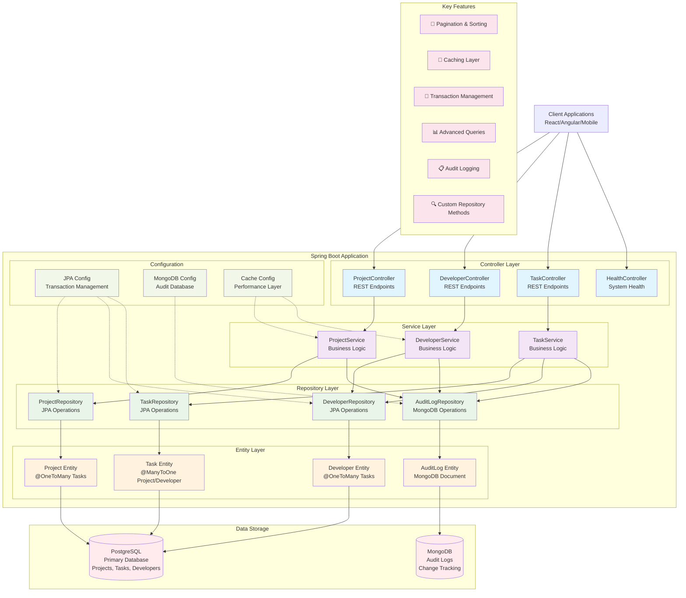

```mermaid
graph TB
%% Client Layer
Client[Client Applications<br/>React/Angular/Mobile]

    %% API Layer
    subgraph "Spring Boot Application"
        subgraph "Controller Layer"
            PC[ProjectController<br/>REST Endpoints]
            DC[DeveloperController<br/>REST Endpoints]
            TC[TaskController<br/>REST Endpoints]
            HC[HealthController<br/>System Health]
        end
        
        subgraph "Service Layer"
            PS[ProjectService<br/>Business Logic]
            DS[DeveloperService<br/>Business Logic]
            TS[TaskService<br/>Business Logic]
        end
        
        subgraph "Repository Layer"
            PR[ProjectRepository<br/>JPA Operations]
            DR[DeveloperRepository<br/>JPA Operations]
            TR[TaskRepository<br/>JPA Operations]
            AR[AuditLogRepository<br/>MongoDB Operations]
        end
        
        subgraph "Entity Layer"
            PE[Project Entity<br/>@OneToMany Tasks]
            DE[Developer Entity<br/>@OneToMany Tasks]
            TE[Task Entity<br/>@ManyToOne Project/Developer]
            AE[AuditLog Entity<br/>MongoDB Document]
        end
        
        subgraph "Configuration"
            JPA[JPA Config<br/>Transaction Management]
            MONGO[MongoDB Config<br/>Audit Database]
            CACHE[Cache Config<br/>Performance Layer]
        end
    end
    
    %% Database Layer
    subgraph "Data Storage"
        PG[(PostgreSQL<br/>Primary Database<br/>Projects, Tasks, Developers)]
        MG[(MongoDB<br/>Audit Logs<br/>Change Tracking)]
    end
    
    %% Data Flow Connections
    Client --> PC
    Client --> DC
    Client --> TC
    Client --> HC
    
    PC --> PS
    DC --> DS
    TC --> TS
    
    PS --> PR
    PS --> AR
    DS --> DR
    DS --> AR
    TS --> TR
    TS --> DR
    TS --> AR
    
    PR --> PE
    DR --> DE
    TR --> TE
    AR --> AE
    
    PE --> PG
    DE --> PG
    TE --> PG
    AE --> MG
    
    JPA -.-> PR
    JPA -.-> DR
    JPA -.-> TR
    MONGO -.-> AR
    CACHE -.-> PS
    CACHE -.-> DS
    
    %% Key Features Annotations
    subgraph "Key Features"
        F1[🔄 Pagination & Sorting]
        F2[💾 Caching Layer]
        F3[🔐 Transaction Management]
        F4[📊 Advanced Queries]
        F5[📋 Audit Logging]
        F6[🔍 Custom Repository Methods]
    end
    
    %% Styling
    classDef controller fill:#e1f5fe
    classDef service fill:#f3e5f5
    classDef repository fill:#e8f5e8
    classDef entity fill:#fff3e0
    classDef database fill:#ffebee
    classDef config fill:#f1f8e9
    classDef feature fill:#fce4ec
    
    class PC,DC,TC,HC controller
    class PS,DS,TS service
    class PR,DR,TR,AR repository
    class PE,DE,TE,AE entity
    class PG,MG database
    class JPA,MONGO,CACHE config
    class F1,F2,F3,F4,F5,F6 feature
```
